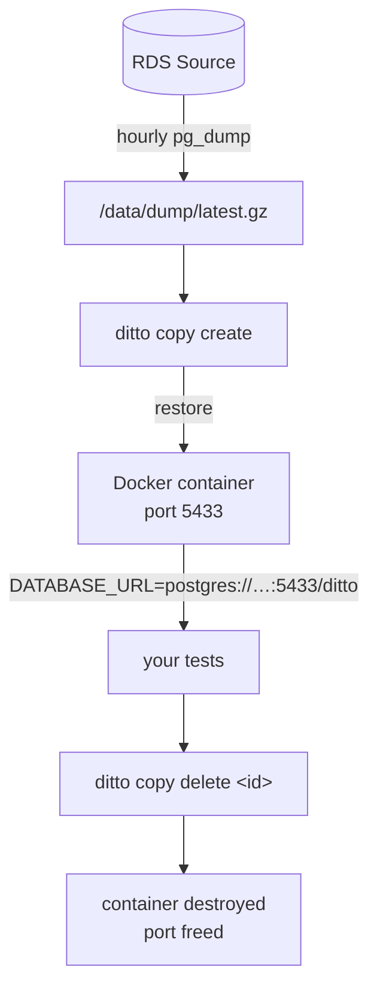
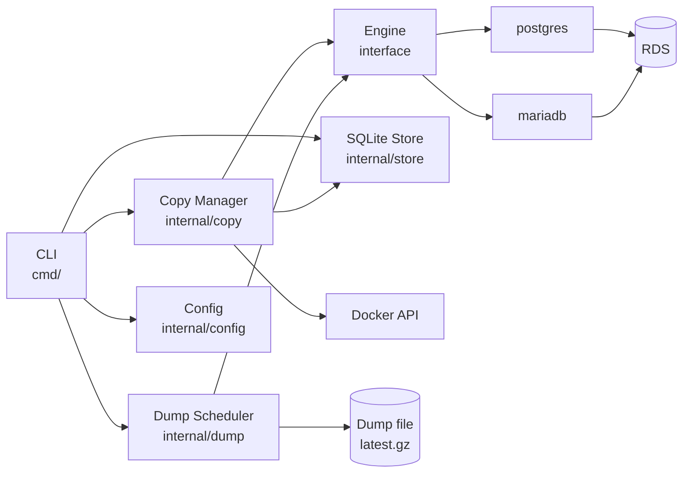

# ditto


[](https://github.com/attaradev/ditto/actions/workflows/ci.yml)

Ephemeral database copies for CI. Each test run gets its own isolated copy of the real database —
same schema, same data shapes, same constraints — created on demand and destroyed when the run ends.

```sh
export DATABASE_URL=$(ditto copy create)
go test ./...
ditto copy delete $DITTO_COPY_ID
```

## The problem

Tests that write to a database need a safe place to write. Shared staging databases cause flaky tests.
Seed scripts drift from the real schema. Transaction rollbacks break background workers and
multi-connection tests.

ditto eliminates shared state. Every test run gets a fresh Docker container restored from a
scheduled dump of the real database.

## How it works



A single EC2 host runs the self-hosted GitHub Actions runner and the copy engine. No separate API,
no daemon (except `ditto daemon` for background scheduling). One SQLite file tracks copy state.

## Requirements

- Go 1.26+
- Docker (running on the same host as the CLI)
- PostgreSQL client tools (`pg_dump`, `pg_restore`) in `$PATH` for Postgres
- MySQL client tools (`mysqldump`, `mysql`) in `$PATH` for MariaDB
- AWS credentials with `secretsmanager:GetSecretValue` if using Secrets Manager for passwords

## Installation

```bash
go install github.com/attaradev/ditto/cmd/ditto@latest
```

Or build from source:

```bash
git clone https://github.com/attaradev/ditto
cd ditto
go build -o /usr/local/bin/ditto ./cmd/ditto
```

## Configuration

Create `ditto.yaml` in the current directory (or `~/.ditto/ditto.yaml`):

```yaml
source:
  engine: postgres            # "postgres" or "mariadb"
  host: mydb.abc.us-east-1.rds.amazonaws.com
  port: 5432
  database: myapp
  user: ditto_dump            # needs SELECT only — no replication privileges
  password_secret: arn:aws:secretsmanager:us-east-1:123456789:secret:ditto-rds

dump:
  schedule: "0 * * * *"      # hourly
  path: /data/dump/latest.gz
  stale_threshold: 7200       # warn if dump is older than this (seconds)

copy_ttl_seconds: 7200        # auto-destroy copies after 2 hours
port_pool_start: 5433
port_pool_end: 5600
```

Use `password` instead of `password_secret` for local development:

```yaml
source:
  engine: postgres
  host: localhost
  port: 5432
  database: myapp
  user: myuser
  password: mypassword
```

Environment variables override config file values. The prefix is `DITTO_` and dots become
underscores:

```bash
DITTO_SOURCE_HOST=other.rds.amazonaws.com ditto copy create
```

## CLI

```text
ditto copy create               # provision a copy, print DATABASE_URL
ditto copy create --ttl 1h      # override TTL
ditto copy list                 # show active copies
ditto copy delete <id>          # destroy immediately
ditto copy logs <id>            # show event log for a copy

ditto reseed                    # run an immediate dump from RDS
ditto status                    # show dump age, active copies, port usage
ditto daemon                    # run dump scheduler + expiry loop (systemd)
```

**Pipe-friendly output:** when stdout is a pipe, `copy create` prints only the connection string.
When stdout is a terminal, it prints a formatted table.

```bash
# Capture connection string
export DATABASE_URL=$(ditto copy create)

# JSON output
ditto copy list | jq '.[].Port'
```

## GitHub Actions integration

Use the composite actions to provision and destroy copies as explicit workflow steps:

```yaml
jobs:
  test:
    runs-on: self-hosted
    steps:
      - uses: actions/checkout@v6

      - id: db
        uses: attaradev/ditto/actions/create@v1
        with:
          ttl: 1h

      - run: go test ./...
        env:
          DATABASE_URL: ${{ steps.db.outputs.database_url }}

      - uses: attaradev/ditto/actions/delete@v1
        if: always()
        with:
          copy_id: ${{ steps.db.outputs.copy_id }}
```

Alternatively, set `DITTO_ENABLED: true` on any job to use the always-on runner hooks. The
pre-job hook provisions a copy and sets `DATABASE_URL`; the post-job hook destroys it regardless
of job outcome.

```yaml
jobs:
  test:
    runs-on: self-hosted
    env:
      DITTO_ENABLED: true
    steps:
      - uses: actions/checkout@v6
      - run: go test ./...
        env:
          DATABASE_URL: ${{ env.DATABASE_URL }}
```

### Runner setup

Install the hooks on the EC2 host:

```bash
cp hooks/pre-job.sh  /home/runner/hooks/pre-job.sh
cp hooks/post-job.sh /home/runner/hooks/post-job.sh
chmod +x /home/runner/hooks/*.sh
```

Add to the runner's systemd service unit (`/etc/systemd/system/actions-runner.service`):

```ini
[Service]
Environment=ACTIONS_RUNNER_HOOK_JOB_STARTED=/home/runner/hooks/pre-job.sh
Environment=ACTIONS_RUNNER_HOOK_JOB_COMPLETED=/home/runner/hooks/post-job.sh
```

The runner user must be in the `docker` group:

```bash
usermod -aG docker runner
```

## Dump scheduler

Run `ditto daemon` as a systemd service to keep the dump fresh and auto-expire stale copies:

```ini
[Unit]
Description=ditto daemon
After=docker.service

[Service]
ExecStart=/usr/local/bin/ditto daemon
Restart=on-failure
User=runner
WorkingDirectory=/home/runner

[Install]
WantedBy=multi-user.target
```

Or run a standalone cron job for just the dump:

```cron
0 * * * * /usr/local/bin/ditto reseed >> /var/log/ditto-reseed.log 2>&1
```

## Database user setup

The dump user needs `SELECT` only — no replication privileges:

**PostgreSQL:**

```sql
CREATE USER ditto_dump WITH PASSWORD 'secret';
GRANT CONNECT ON DATABASE myapp TO ditto_dump;
GRANT USAGE ON SCHEMA public TO ditto_dump;
GRANT SELECT ON ALL TABLES IN SCHEMA public TO ditto_dump;
ALTER DEFAULT PRIVILEGES IN SCHEMA public GRANT SELECT ON TABLES TO ditto_dump;
```

**MariaDB:**

```sql
CREATE USER 'ditto_dump'@'%' IDENTIFIED BY 'secret';
GRANT SELECT, SHOW VIEW, EVENT, TRIGGER ON myapp.* TO 'ditto_dump'@'%';
FLUSH PRIVILEGES;
```

## Adding a new engine

1. Create `engine/{name}/{name}.go`
2. Implement the `engine.Engine` interface (6 methods)
3. Add `func init() { engine.Register(&Engine{}) }`
4. Add a blank import to `cmd/ditto/main.go`

```go
// engine/mysql/mysql.go
package mysql

import (
    "github.com/attaradev/ditto/engine"
)

func init() { engine.Register(&Engine{}) }

type Engine struct{}

func (e *Engine) Name() string { return "mysql" }
// ... implement remaining 5 methods
```

No changes to core packages required.

## Development

```bash
# Unit tests (no external dependencies)
go test ./...

# Unit tests with race detector
go test -race ./...

# Integration tests (requires Docker)
go test -tags integration ./internal/copy/...

# Build
go build ./cmd/ditto
```

See [CONTRIBUTING.md](CONTRIBUTING.md) for development setup and conventions.

## Architecture



- [Design document](docs/design.md) — ADRs, component design, data model
- `engine/engine.go` — the Engine interface every database backend implements
- `internal/store/` — SQLite store (WAL mode, copies + events tables)
- `internal/copy/manager.go` — copy lifecycle (create, destroy, expiry, orphan recovery)
- `internal/dump/scheduler.go` — dump scheduling with atomic file swap

## License

[MIT](LICENSE)
