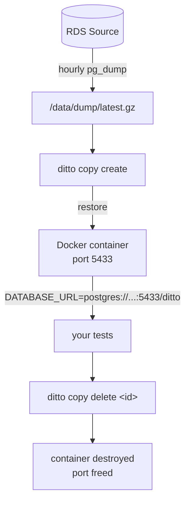

# ditto


[](https://github.com/attaradev/ditto/actions/workflows/ci.yml)

## Reliable database tests for CI

ditto provisions isolated Postgres or MariaDB copies from a scheduled dump, so
every test run gets a clean database instead of fighting shared staging state.

- Eliminate flaky tests caused by shared databases
- Test against real schema, constraints, and data shapes
- Run on a self-hosted runner without adding a control plane

```sh
COPY=$(ditto copy create --format=json)
export DATABASE_URL=$(echo "$COPY" | jq -r '.ConnectionString')
COPY_ID=$(echo "$COPY" | jq -r '.ID')

go test ./...
ditto copy delete "$COPY_ID"
```

## Why teams use ditto

Database-backed CI gets unreliable when every job fights for the same staging
database. One run mutates data for the next. Seed fixtures drift away from
production reality. Transaction cleanup breaks as soon as background jobs,
multiple connections, or out-of-process workers enter the picture.

ditto gives each run a clean test database restored from a scheduled source
dump. You keep production-like schema and data shapes, while avoiding another
API service, control plane, or long-lived shared test environment.

When ditto is a good fit:

- You already run CI on self-hosted runners.
- Your tests need real database behavior, not mocked persistence.
- Shared staging contention or schema drift is already hurting reliability.

## Quick start

You will need:

- Go 1.26+
- Docker on the same host as the CLI
- `pg_dump` and `pg_restore` for Postgres sources
- `mysqldump` and `mysql` for MariaDB sources
- AWS credentials with `secretsmanager:GetSecretValue` if you store passwords in Secrets Manager

Install the CLI:

```bash
go install github.com/attaradev/ditto/cmd/ditto@latest
```

Or build from source:

```bash
git clone https://github.com/attaradev/ditto
cd ditto
go build -o /usr/local/bin/ditto ./cmd/ditto
```

Create `ditto.yaml` in the current directory or in `~/.ditto/ditto.yaml`:

```yaml
source:
  engine: postgres
  host: mydb.abc.us-east-1.rds.amazonaws.com
  port: 5432
  database: myapp
  user: ditto_dump
  password_secret: arn:aws:secretsmanager:us-east-1:123456789:secret:ditto-rds

dump:
  schedule: "0 * * * *"
  path: /data/dump/latest.gz
  stale_threshold: 7200

copy_ttl_seconds: 7200
port_pool_start: 5433
port_pool_end: 5600
```

Create a clean test database, run your suite, and clean it up:

```sh
COPY=$(ditto copy create --format=json)
export DATABASE_URL=$(echo "$COPY" | jq -r '.ConnectionString')
COPY_ID=$(echo "$COPY" | jq -r '.ID')

go test ./...
ditto copy delete "$COPY_ID"
```

## How it works



ditto typically runs on the same self-hosted runner host that owns Docker and
the local dump file. One SQLite database tracks copy state. There is no
separate control plane, and the only long-running process is `ditto daemon` if
you want scheduled dumps and TTL-based cleanup.

## GitHub Actions integration

Use the composite actions when you want explicit setup and cleanup steps in a job:

```yaml
jobs:
  test:
    runs-on: self-hosted
    steps:
      - uses: actions/checkout@v6

      - id: db
        uses: attaradev/ditto/actions/create@v1
        with:
          ttl: 1h

      - run: go test ./...
        env:
          DATABASE_URL: ${{ steps.db.outputs.database_url }}

      - uses: attaradev/ditto/actions/delete@v1
        if: always()
        with:
          copy_id: ${{ steps.db.outputs.copy_id }}
```

If your runner is already dedicated to ditto-backed jobs, set `DITTO_ENABLED:
true` to use the pre-job and post-job hooks instead. The pre-job hook creates
the isolated database copy and sets `DATABASE_URL`. The post-job hook deletes
it even when the job fails.

```yaml
jobs:
  test:
    runs-on: self-hosted
    env:
      DITTO_ENABLED: true
    steps:
      - uses: actions/checkout@v6
      - run: go test ./...
        env:
          DATABASE_URL: ${{ env.DATABASE_URL }}
```

## Configuration

Use individual fields in `ditto.yaml` when you want explicit control over engine, host, and credentials:

```yaml
source:
  engine: postgres
  host: mydb.abc.us-east-1.rds.amazonaws.com
  port: 5432
  database: myapp
  user: ditto_dump
  password_secret: arn:aws:secretsmanager:us-east-1:123456789:secret:ditto-rds

dump:
  schedule: "0 * * * *"
  path: /data/dump/latest.gz
  stale_threshold: 7200

copy_ttl_seconds: 7200
port_pool_start: 5433
port_pool_end: 5600
```

For local development, you can use `password` instead of `password_secret`:

```yaml
source:
  engine: postgres
  host: localhost
  port: 5432
  database: myapp
  user: myuser
  password: mypassword
```

Environment variables override config file values. The prefix is `DITTO_` and
dots become underscores:

```bash
DITTO_SOURCE_HOST=other.rds.amazonaws.com ditto copy create
```

If you prefer to provide the source in a single value, ditto also supports
`source.url` for Postgres, PostgreSQL, MySQL, and MariaDB DSNs.

## Operational model

ditto is designed for teams already running self-hosted runners. A typical
setup has one host running the GitHub Actions runner, Docker, the local dump
file, and the SQLite metadata database. `ditto daemon` keeps the dump fresh
and cleans up expired copies.

### Runner setup

Install the hooks on the EC2 host:

```bash
cp hooks/pre-job.sh  /home/runner/hooks/pre-job.sh
cp hooks/post-job.sh /home/runner/hooks/post-job.sh
chmod +x /home/runner/hooks/*.sh
```

Add to the runner's systemd service unit (`/etc/systemd/system/actions-runner.service`):

```ini
[Service]
Environment=ACTIONS_RUNNER_HOOK_JOB_STARTED=/home/runner/hooks/pre-job.sh
Environment=ACTIONS_RUNNER_HOOK_JOB_COMPLETED=/home/runner/hooks/post-job.sh
```

The runner user must be in the `docker` group:

```bash
usermod -aG docker runner
```

### Keep dumps fresh

Run `ditto daemon` as a systemd service when you want scheduled dumps and automatic cleanup of expired copies:

```ini
[Unit]
Description=ditto daemon
After=docker.service

[Service]
ExecStart=/usr/local/bin/ditto daemon
Restart=on-failure
User=runner
WorkingDirectory=/home/runner

[Install]
WantedBy=multi-user.target
```

Or run a standalone cron job for just the dump:

```cron
0 * * * * /usr/local/bin/ditto reseed >> /var/log/ditto-reseed.log 2>&1
```

## Security and data handling

- Source database passwords can come from AWS Secrets Manager, and ditto does not persist them in SQLite.
- Copy containers bind to `127.0.0.1`, so they are local to the runner host.
- Copies may contain real production data, so disk encryption and runner access control still matter.
- Access to the Docker socket is effectively root-level access on the host and should be tightly restricted.

See [SECURITY.md](SECURITY.md) for the full security model and disclosure policy.

## Advanced and extension material

### Database user setup

The dump user needs `SELECT` only and does not require replication privileges.

**PostgreSQL:**

```sql
CREATE USER ditto_dump WITH PASSWORD 'secret';
GRANT CONNECT ON DATABASE myapp TO ditto_dump;
GRANT USAGE ON SCHEMA public TO ditto_dump;
GRANT SELECT ON ALL TABLES IN SCHEMA public TO ditto_dump;
ALTER DEFAULT PRIVILEGES IN SCHEMA public GRANT SELECT ON TABLES TO ditto_dump;
```

**MariaDB:**

```sql
CREATE USER 'ditto_dump'@'%' IDENTIFIED BY 'secret';
GRANT SELECT, SHOW VIEW, EVENT, TRIGGER ON myapp.* TO 'ditto_dump'@'%';
FLUSH PRIVILEGES;
```

### Adding a new engine

1. Create `engine/{name}/{name}.go`
2. Implement the `engine.Engine` interface (6 methods)
3. Add `func init() { engine.Register(&Engine{}) }`
4. Add a blank import to `cmd/ditto/main.go`

```go
// engine/mysql/mysql.go
package mysql

import (
    "github.com/attaradev/ditto/engine"
)

func init() { engine.Register(&Engine{}) }

type Engine struct{}

func (e *Engine) Name() string { return "mysql" }
// ... implement remaining 5 methods
```

No changes to core dispatch are required beyond registering the engine and importing it in the CLI entrypoint.

### Development

```bash
go test ./...
go test -race ./...
go test -tags integration ./internal/copy/...
go build ./cmd/ditto
```

See [CONTRIBUTING.md](CONTRIBUTING.md) for development setup and conventions.

### Repository landmarks

- `cmd/` - CLI commands and the main entrypoint
- `engine/` - the engine interface and database-specific implementations
- `internal/copy/` - isolated copy lifecycle and port allocation
- `internal/dump/` - scheduled source dumps with atomic file replacement
- `internal/store/` - SQLite metadata for copies and lifecycle events

## License

[MIT](LICENSE)
