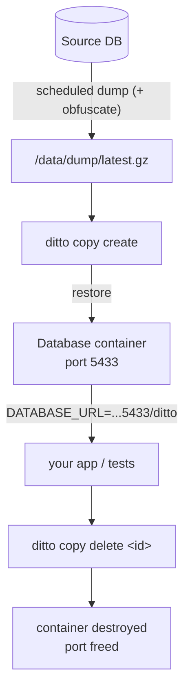

<p align="center">
  
</p>

<h1 align="center">ditto</h1>

<p align="center">
  <a href="https://github.com/attaradev/ditto/actions/workflows/ci.yml">
    
  </a>
  <a href="https://github.com/attaradev/ditto/releases/latest">
    
  </a>
  <a href="https://pkg.go.dev/github.com/attaradev/ditto">
    
  </a>
  <a href="https://goreportcard.com/report/github.com/attaradev/ditto">
    
  </a>
  <a href="LICENSE">
    
  </a>
</p>

## Real production data. Zero risk. For every run

ditto provisions isolated Postgres and MySQL copies from a scheduled production
dump — with PII obfuscated once at source, so every copy carries real schema and
real data shapes without exposing sensitive information. No shared state. No seed
scripts. No fabricated fixtures.

```sh
ditto copy run -- go test ./...
```

> **Real data, safely.** Configure obfuscation rules once and ditto bakes PII
> scrubbing into the dump file — every copy restored from it is already clean.
> Developers get production-faithful data shapes without ever seeing raw PII.

## Use cases

| Use case | What ditto does |
| --- | --- |
| **CI test isolation** | Each job gets a clean throwaway copy; no shared staging contention |
| **Migration dry-runs** | Validate `migrate up` against real data before merge |
| **Parallel test sharding** | Each shard worker calls `copy create`; the port pool handles allocation |
| **Local dev sandbox** | Every developer gets their own isolated copy; no more "who broke staging?" |
| **Compliance-safe dev** | Obfuscation rules bake PII scrubbing into the dump once — every copy is safe |
| **Load and perf testing** | Mutations stay in the throwaway copy; staging is never polluted |
| **Incident reproduction** | Restore a recent dump locally to reproduce and debug production bugs |

## The problem ditto solves

Databases become unreliable when runs share the same environment. **Shared mutation** means one run's
writes pollute the next's reads. **Schema drift** means seed fixtures diverge from production shapes
until tests pass on fabricated data and fail on real data. **Rollback fragility** means transaction
cleanup breaks under background jobs and multiple connections — the exact conditions production runs
under. **Fabricated data** hides the edge cases and constraint violations that only appear on real
data, but real data can't go to developers because of PII.

ditto eliminates all four. Each run gets a copy restored from a production dump with PII scrubbed at
source — real schema, real data shapes, no shared state, no PII exposure.

When ditto is a good fit:

- You want each test run, migration, or dev session to start from a clean slate
- Your tests need real database behavior — DDL, constraints, triggers — not mocked persistence
- Shared staging contention or schema drift is already costing you reliability
- You want sub-second database provisioning without standing up extra infrastructure

## Install

**Homebrew** (macOS and Linux):

```bash
brew tap attaradev/ditto
brew install ditto
```

**Debian / Ubuntu** — download the `.deb` from the [latest release](https://github.com/attaradev/ditto/releases/latest):

```bash
sudo dpkg -i ditto_<version>_linux_amd64.deb
```

**RPM** (Fedora / RHEL / Amazon Linux):

```bash
sudo rpm -i ditto_<version>_linux_amd64.rpm
```

**Alpine**:

```bash
apk add --allow-untrusted ditto_<version>_linux_amd64.apk
```

**Go install**:

```bash
go install github.com/attaradev/ditto/cmd/ditto@latest
```

**Build from source**:

```bash
git clone https://github.com/attaradev/ditto
cd ditto
go build -o /usr/local/bin/ditto ./cmd/ditto
```

## Quick start

**Prerequisites:**

- A Docker-compatible runtime on the same host as ditto
- A source database hostname reachable from that runtime (`localhost` and `127.0.0.1` on the host
  are not sufficient for dump helpers)

Create `ditto.yaml` in the current directory or `~/.ditto/ditto.yaml`:

```yaml
source:
  engine: postgres          # or mysql
  host: db.example.com
  port: 5432
  database: myapp
  user: ditto_dump
  password: secret          # dev only — use password_secret in production

dump:
  schedule: "0 * * * *"
  path: /data/dump/latest.gz

copy_ttl_seconds: 7200
port_pool_start: 5433
port_pool_end: 5600
```

Take a first dump, then run your tests against a fresh copy:

```sh
ditto reseed
ditto copy run -- go test ./...
```

ditto runs dump and restore work through the configured Docker runtime — no host-installed
`pg_dump`, `pg_restore`, `mysqldump`, or Docker CLI required.

## How it works



ditto runs on the same host that owns the Docker-compatible runtime and the local dump file. One
SQLite database tracks copy state. The only long-running process is `ditto daemon`, which handles
scheduled dumps and TTL-based cleanup. There is no separate control plane.

## Security

- Credentials are never persisted in SQLite. Resolve them at runtime via `env:`, `file:`, or
  `arn:aws:` secret references.
- Copy containers bind to `127.0.0.1`, keeping them local to the host.
- Configure obfuscation rules so `ditto reseed` scrubs PII into the dump file before any copy is
  created. Copies restored from a pre-obfuscated dump never expose production data to callers.
- Access to the container runtime socket is effectively root-level on the host; restrict it accordingly.

See [SECURITY.md](SECURITY.md) for the full security model and disclosure policy.

## Documentation

| Topic | |
| --- | --- |
| [Configuration](docs/configuration.md) | Full YAML reference, secret backends, obfuscation strategies, runtime overrides |
| [CI integration](docs/ci.md) | GitHub Actions, server mode, Go SDK, Python SDK |
| [Local development](docs/local-dev.md) | Daily workflow, shell integration, ERD generation, team sharing |
| [Operations](docs/operations.md) | systemd, cron, runner setup, database user permissions |
| [Contributing](CONTRIBUTING.md) | Dev setup, test commands, adding a new engine |

## License

[MIT](LICENSE)
