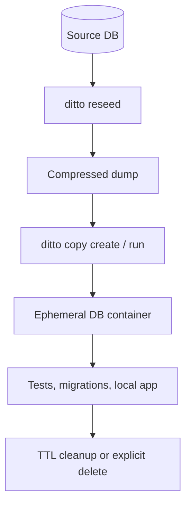

# Architecture And Operating Model

ditto exists to solve a specific reliability problem: database-backed workflows break down when tests
or developers share mutable state.

## The problem

Shared staging databases create several classes of failure:

- one run mutates rows that another run expects to read unchanged
- local fixtures drift away from production schema and real data shape
- transaction rollback is not enough when background jobs or multiple connections are involved
- real production data cannot safely be handed to every developer or CI runner

ditto addresses those problems by making the database copy itself the unit of isolation.

## Lifecycle

The same lifecycle applies in both modes. What changes is which machine owns the dump, copy
containers, and cleanup loop.

## Control-plane pieces

ditto keeps a small amount of local state alongside Docker:

- a compressed dump file that every new copy restores from
- a SQLite metadata database that tracks copy status, ports, TTL, and ownership
- an event log used by `ditto copy logs`
- an optional warm pool of pre-restored copies for low-latency `copy create`

`ditto host` adds the long-running control loop around those pieces: scheduled reseeds, TTL expiry,
warm-pool refill, orphan recovery, and the authenticated `/v2` API.

## Why dumps instead of live cloning

ditto intentionally works from a dump file instead of cloning a live database for every request:

- one scheduled dump can serve many copy restores
- copy creation is local to the ditto host
- obfuscation can happen once at dump time instead of on every restore
- the source database is touched during `reseed`, not during every test run

That operating model makes CI and developer workflows cheaper and more predictable, at the cost of
working from a recent snapshot instead of the live database state.

## Where obfuscation belongs

Obfuscation is safest when it happens before the dump is reused:

1. `ditto reseed` restores or stages data as needed
2. obfuscation rules scrub sensitive columns
3. ditto writes the final dump file
4. later copies are restored from already-scrubbed data

That reduces the chance that raw production data escapes into a developer shell, CI job, or copied
database.

## Local mode vs shared-host mode

### Local mode

In local mode, the same host owns:

- the Docker-compatible runtime
- the dump file
- the SQLite metadata database
- the CLI commands that create and destroy copies

This is the simplest mode for self-hosted CI or single-machine setups.

### Shared-host mode

In shared-host mode, one machine runs `ditto host` and remote clients call the authenticated `/v2`
API through `--server`.

This is useful when:

- CI runners should not access Docker directly
- developers should not manage local dump files
- you want one trusted host to own source credentials and dump refresh

In this mode, the host is also the security boundary:

- caller identity comes from `DITTO_TOKEN`
- non-admin callers can list, inspect events for, and delete only their own copies
- admin callers can also query host-level status
- remote copy credentials are derived per copy from `server.copy_secret_secret`

## Important constraints

ditto is intentionally opinionated. These constraints matter:

- the source database must be reachable from the Docker runtime, not just from the host shell
- loopback source hosts such as `localhost` are rejected
- in shared-host mode, copy ports are published on `server.db_bind_host` and DSNs use `server.advertise_host`
- in the current shared-host implementation, remote copy TLS material must be configured with `server.db_tls`
- access to the Docker socket is effectively host-level privilege
- dump freshness is a trade-off between realism and operational cost

If those constraints fit your environment, ditto gives you isolated databases with much less ongoing
coordination than shared staging.
